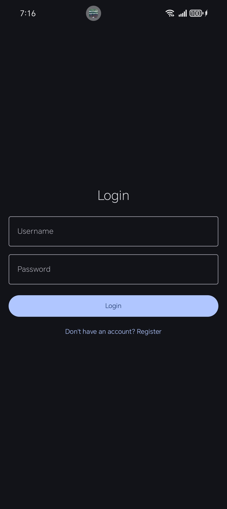
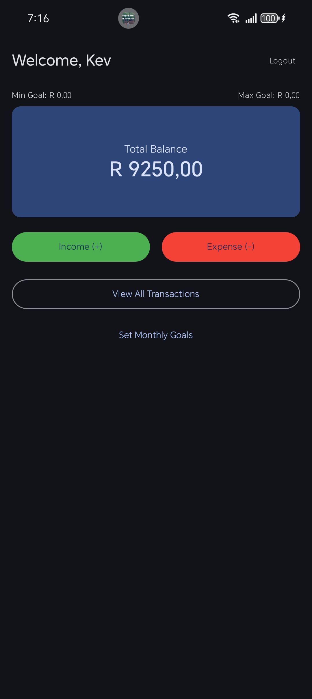
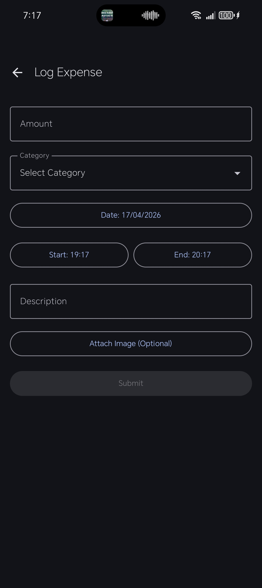
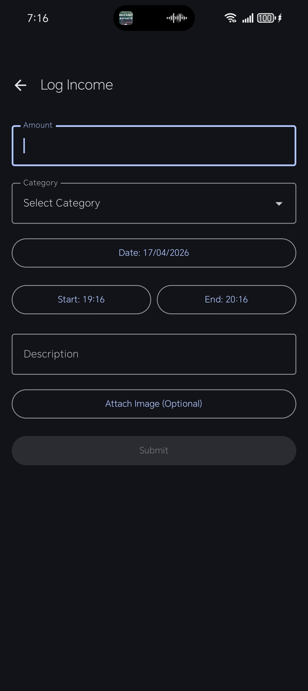
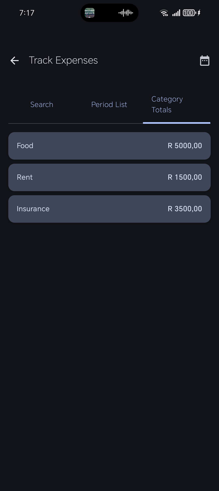

# POE Part 2 - Budget Tracker Android App

**Module:** OPSC6311/w - Open-Source Coding (Introduction)  
**Assessment:** Practical Open-Ended (POE) Part 2  
**Student:** 

Kevin Mbatha ST10070515

Chelsea Solomons ST10398698

Dan ST10408412

**Date:** April 2026

---

## 📋 Project Overview

This is a **fully functional Android Budget Tracker** application developed as part of the OPSC6311 POE Part 2.

The app allows users to manage their personal finances by logging income and expenses, tracking spending by category over custom date ranges, setting monthly financial goals, and viewing all transactions with attached photos.

All data is persistently stored in a local **Room Database**. The app follows **MVVM architecture** with clean separation of concerns.

---

## ✨ Features Implemented (All POE Part 2 Requirements Met)

-  User registration and login (username + password)
-  Create custom income and expense categories (with automatic default categories)
-  Log income and expense entries (amount, description, date, start/end time, category, optional photo)
-  Attach and view photographs for each transaction
-  Set minimum and maximum monthly financial goals
-  Dashboard showing total balance and goals
-  View all transactions with search functionality
-  Track expenses over a user-selectable date range
-  View total amount spent per category in a selected period
-  Modern, clean Material 3 UI with proper navigation
-  Full logging system (`AppLogger`) for debugging and code understanding
-  Proper error handling and input validation

**Bonus features added:**
- Symmetric Income & Expense tracking
- Tabbed view (Search / Period List / Category Totals) for tracking
- Real-time balance calculation
- Photo preview dialog

---

## 🛠️ Technologies & Architecture

- **Language:** Kotlin
- **UI:** Jetpack Compose + Material 3
- **Database:** Room (SQLite) with DAO + Repository pattern
- **Architecture:** MVVM (ViewModel + StateFlow)
- **Navigation:** Jetpack Navigation Component
- **Image Handling:** Coil + Photo Picker
- **Date/Time:** DatePicker & TimePicker
- **Logging:** Custom `AppLogger` utility (POE requirement)

---

## 📱 How to Run the App

1. Clone or download the project.
2. Open the project in **Android Studio**.
3. Wait for Gradle sync to complete.
4. Run the app on an emulator (API 34+) or physical Android device.
5. Create an account or log in with existing credentials.
6. Start logging transactions and exploring the features.

**Note:** The app uses a local Room database — no internet required.

---

## 📸 Screenshots

- **Login / Register Screen**
  

- **Dashboard**

- **Log Expense**

- **Log Income**

- **Track Expenses (with date range & category totals)**

- **All Transactions**

- **Set Monthly Goals**

---

## 🎥 Video Demonstration

**Link:** [Insert your YouTube / Google Drive video link here]

The video demonstrates:
- Registration and login
- Setting goals
- Creating categories
- Logging income & expense (with photo)
- Viewing all transactions
- Tracking expenses with date range and category totals
- Dashboard overview

***(Mandatory for POE – please record a clear voice-over video showing every required feature)***

---

## Project Structure Highlights

- `data/` → Room entities, DAOs, Repositories
- `ui/` → All Compose screens and ViewModels
- `util/AppLogger.kt` → Central logging utility
- `MainActivity.kt` → Navigation and dependency setup

---

## ⚠️ Known Limitations

- Passwords are stored in plain text (for demonstration purposes only).
- `Bucket.kt` entity was created but not fully implemented (planned for Part 3 gamification/savings buckets).
- No unit tests included in this submission (will be added in final POE if required).
- Built and tested on Android 14 (API 34).

---

## 📌 Submission Information

- This is **Part 2** of the POE (App Prototype).
- All minimum requirements on pages 7–8 of the POE document have been fully implemented and exceeded.
- Ready for Part 3 (graphs, gamification, additional features).

---

**Thank you for reviewing our submission!**  
I am happy to answer any questions or demonstrate the app live.

— Tshiamo Kevin Mbatha ST

— Chelsea Solomons ST 

— Dan 

Cape Town, South Africa  
April 2026
